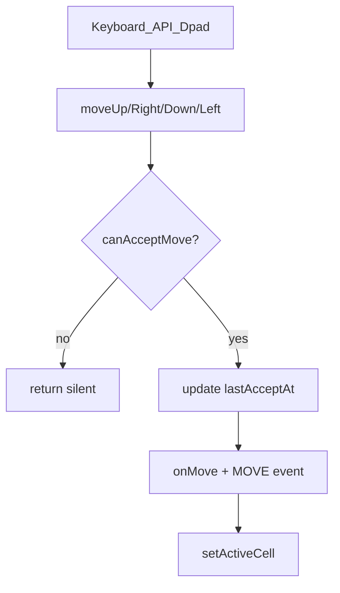

# Add `moveDebounce` option

## Behavior

- **`number`**: global cooldown — after any accepted directional move, wait that many ms before accepting another (any direction).
- **`[number, number, number, number]`**: per-direction cooldown as **`[Top, Right, Down, Left]`** → `UP`, `RIGHT`, `DOWN`, `LEFT` (CSS TRBL-style order).
- **`undefined` / omitted**: no debounce (current behavior). Default: omit from constructor defaults.
- Debounce gates **all** entry points that go through `moveUp` / `moveRight` / `moveDown` / `moveLeft` (keyboard, programmatic API, demo D-pad). It does **not** affect `setActiveCell` / cell click teleports.
- Rejected-by-time attempts return silently: no `onMove`, no `MOVE_*` events, no `setActiveCell`.
- Timestamp updates when a move is **accepted** (passes the debounce check and proceeds), matching when `onMove` would fire — including attempts that later block on barriers.

## Implementation

### 1. Type — [`src/interfaces.ts`](src/interfaces.ts)

Add to `IOptions` near other input options (`arrowControls` / `wasdControls`):

```ts
/**
 * Milliseconds to wait before accepting another directional move.
 * - `number`: shared cooldown for any direction
 * - `[Top, Right, Down, Left]`: per-direction cooldowns (UP, RIGHT, DOWN, LEFT)
 */
moveDebounce?: number | [number, number, number, number];
```

### 2. Runtime guard — [`src/index.ts`](src/index.ts)

- Private last-accept timestamps (e.g. one `lastMoveAt` for scalar mode, or four keyed by direction for array mode — a small map/tuple is fine).
- Private helper `canAcceptMove(direction: directionEnum): boolean` that:
  - returns `true` when `moveDebounce` is unset
  - resolves delay from scalar or array index (`UP→0`, `RIGHT→1`, `DOWN→2`, `LEFT→3`)
  - compares `Date.now()` (or injectable clock) against last accept time
  - on success, records the new timestamp and returns `true`
- At the top of each of `moveUp` / `moveRight` / `moveDown` / `moveLeft` (~671–717), before callbacks/emit:

```ts
if (!this.canAcceptMove(directionEnum.UP)) return;
```

No constructor default needed; `setOptions` already shallow-merges so runtime updates work.

### 3. Tests

Add coverage (fake timers via Vitest) in [`src/__tests__/move.test.ts`](src/__tests__/move.test.ts) and/or [`src/__tests__/input.test.ts`](src/__tests__/input.test.ts):

- Scalar: rapid `moveRight` twice within window → second ignored; after advance timers → accepted
- Array: debounce only the configured direction; other directions still move
- Unset option: unrestricted moves
- Keyboard path still respects debounce (via `move*`)

### 4. Docs

Mirror the option in [`README.md`](README.md) `IOptions` section (and defaults table if present). JSDoc on `IOptions` is enough for TypeDoc/`npm run docs`.

## Flow


