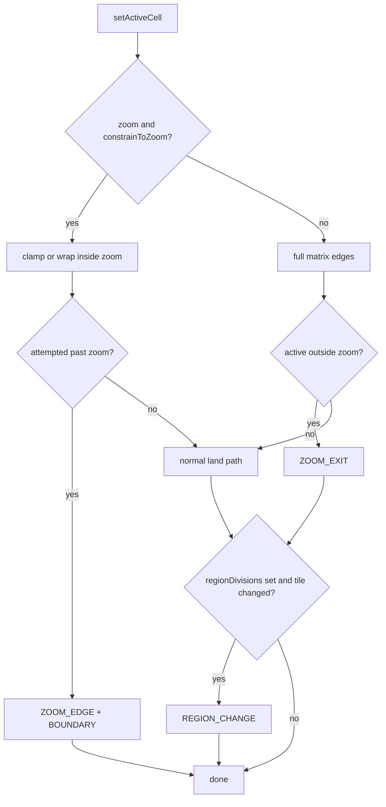

# Zoom / quadrant API (issue [#11](https://github.com/tamb/game-grid/issues/11))

## Vocabulary

Keep these terms distinct in API names, docs, and events:

| Term | Meaning |
|------|---------|
| **zoom** | The current viewport window (`IZoomBounds` on state). Not DOM focus, not the active cell. |
| **region** | A tile from partitioning the full grid (`divisions×divisions`; quadrants are `divisions === 2`). |
| **active cell** | Current playhead (`activeCoords`). Unchanged concept. |
| **zoom edge** | Active cell tried to move *past* the current zoom window while still constrained inside it. |
| **zoom exit** | Active cell’s world position is *outside* the current zoom bounds (only when constraint allows leaving). |
| **region change** | Active cell moved from one region tile to another (e.g. SE → SW). |
| **zoom slide** | Moving the zoom window to a new region/bounds with `animate: true` (camera follows). Not a separate method — a usage pattern / future built-in animation. |

No new “hooks” system. Match existing [`IOptions.callbacks`](src/interfaces.ts) + `gridEventsEnum` events.

## Decisions

- **Model**: viewport on the same `GameGrid` — full matrix stays in memory; coords stay world `[x, y]`.
- **v1 scope**: public API + movement rules + events/callbacks. Rendering still paints the full grid; a later PR filters DOM and honors `animate` for built-in **zoom slide** visuals.
- **Default zoom**: none (`null`) until `setZoom` / convenience methods run.
- **Constraint**: `constrainToZoom` default `true` — movement clamps/wraps inside zoom; hitting the window edge emits **zoom edge** (and existing `BOUNDARY_*` when clamped).
- **Unconstrained**: `constrainToZoom: false` — movement uses full-matrix edges; if the active cell leaves zoom bounds, emit **zoom exit** (zoom state stays until changed/cleared).
- **Region tracking**: opt-in via `regionDivisions` (`2` = quadrants, `3` = ninths). When set, successful moves that change tile emit **region change**.
- **Animate**: `animateZoom` global + per-call `IZoomOptions.animate` (default `false`).

## Public API shape

### Types ([`src/interfaces.ts`](src/interfaces.ts))

```ts
/** Inclusive axis-aligned zoom window in world coordinates. */
export interface IZoomBounds {
  minX: number;
  minY: number;
  maxX: number;
  maxY: number;
}

/** Per-call overrides for setZoom / clearZoom / convenience zoom methods. */
export interface IZoomOptions {
  /** Overrides `IOptions.animateZoom` for this call only. */
  animate?: boolean;
}

/** A fraction/quadrant tile index within the full grid. */
export interface IRegionTile {
  divisions: number;
  tileX: number;
  tileY: number;
  /** Present when `divisions === 2`. */
  quadrant?: ZoomQuadrant;
}

export type ZoomQuadrant = 'nw' | 'ne' | 'sw' | 'se';
```

State ([`IState`](src/interfaces.ts) / [`INITIAL_STATE`](src/enums.ts)):

```ts
zoom: IZoomBounds | null;       // default null
region: IRegionTile | null;     // last known tile when regionDivisions is set; else null
```

### Options ([`IOptions`](src/interfaces.ts))

```ts
/** Default whether zoom transitions animate. Overridden by IZoomOptions.animate. Default: false. */
animateZoom?: boolean;

/**
 * When zoom is set, keep movement inside the zoom window.
 * true (default): clamp/wrap to zoom; attempts past the window emit ZOOM_EDGE.
 * false: full-matrix movement; leaving the window emits ZOOM_EXIT.
 */
constrainToZoom?: boolean;

/**
 * Opt-in region tracking. `2` = quadrants, `3` = ninths, etc.
 * When set, moves that change tile emit REGION_CHANGE and update state.region.
 */
regionDivisions?: number;
```

Ctor defaults: `animateZoom: false`, `constrainToZoom: true`, `regionDivisions` unset.

### Animate resolution

```ts
const animate = options?.animate ?? this.options.animateZoom ?? false;
```

Per-call wins when defined; include resolved `animate` on zoom set/cleared event detail.

### Instance methods

| Method | Behavior |
|--------|----------|
| `getZoom()` | Current bounds or `null` |
| `setZoom(bounds, options?)` | Normalize to matrix; store; clamp `activeCoords` into bounds; resolve animate; emit `ZOOM_SET`; refresh `state.region` if tracking |
| `clearZoom(options?)` | `zoom = null`; emit `ZOOM_CLEARED` |
| `getZoomAround(center, radiusX, radiusY?)` | Cell ± radii, clipped to matrix |
| `getQuadrantZoom(quadrant)` | NW/NE/SW/SE bounds |
| `getFractionZoom(divisions, tileX, tileY)` | Tile bounds |
| `zoomAround` / `zoomQuadrant` / `zoomFraction` | Compute + `setZoom(..., options?)` |
| `getRegionAt(coords, divisions?)` | Pure: tile for a cell (`divisions` defaults to `options.regionDivisions`) |
| `getActiveRegion()` | `state.region` (or compute from active cell when tracking) |

### Events ([`src/enums.ts`](src/enums.ts))

| Event | Name | When | Detail extras |
|-------|------|------|----------------|
| `ZOOM_SET` | `gamegrid:zoom:set` | After zoom applied | `{ animate, zoom }` |
| `ZOOM_CLEARED` | `gamegrid:zoom:cleared` | After zoom cleared | `{ animate, zoom: null }` |
| `ZOOM_EDGE` | `gamegrid:zoom:edge` | Move attempted past zoom while `constrainToZoom` | `{ direction, zoom, activeCoords }` |
| `ZOOM_EXIT` | `gamegrid:zoom:exit` | Active cell left zoom while unconstrained | `{ direction?, zoom, activeCoords, prevCoords }` |
| `REGION_CHANGE` | `gamegrid:region:change` | Active cell’s region tile changed | `{ from, to }` as `IRegionTile` |

`ZOOM_EDGE` still pairs with existing `BOUNDARY_*` when the move is clamped. Apps that want the SE→SW **zoom slide** listen for `ZOOM_EDGE` (e.g. direction `LEFT` in SE) and call `zoomQuadrant('sw', { animate: true })`.

### Callbacks ([`IOptions.callbacks`](src/interfaces.ts))

Same signature style as `onBoundary` / `onLand`:

- `onZoomSet?(gg, state)`
- `onZoomCleared?(gg, state)`
- `onZoomEdge?(gg, state)`
- `onZoomExit?(gg, state)`
- `onRegionChange?(gg, state)`

### Region math rules

Prefer [`src/zoom.ts`](src/zoom.ts) pure helpers + thin `GameGrid` wrappers.

- **Matrix size**: `H = matrix.length`; `W = max row length` for tiling; per-move X respects row length ∩ zoom.
- **Around**: center ± radius, clip to matrix.
- **Fractions / quadrants**: tile size `floor(size/divisions)`, last tile absorbs remainder. Quadrants = `getFractionZoom(2, …)` + `ZoomQuadrant` labels (`nw=0,0`, `ne=1,0`, `sw=0,1`, `se=1,1`).
- **Invalid input**: throw for negative radii, `divisions < 2`, bad tile indices, inverted bounds.

## Movement integration

[`getValidXandY`](src/index.ts) effective edges:

- No zoom → full matrix (today).
- Zoom + `constrainToZoom` → zoom bounds; wrap stays inside zoom; past-edge attempts → `ZOOM_EDGE` (+ `BOUNDARY_*` if clamped).
- Zoom + `!constrainToZoom` → full matrix; after a successful move with active outside zoom → `ZOOM_EXIT`.

Region tracking (when `regionDivisions` set): after a successful coord change, compare `getRegionAt(prev)` vs `getRegionAt(active)`; on difference update `state.region` and emit `REGION_CHANGE`.



### Canonical SE → SW slide pattern

```ts
gg.setOptions({ regionDivisions: 2, animateZoom: true });
gg.zoomQuadrant('se');

target.addEventListener(gridEventsEnum.ZOOM_EDGE, (e) => {
  const { gameGridInstance } = e.detail;
  // app decides adjacent region from direction + getActiveRegion()
  gameGridInstance.zoomQuadrant('sw', { animate: true }); // zoom slide
});
```

v1 does not auto-slide; it gives events + APIs so apps (and a later built-in) can.

## Tests & docs

- [`src/__tests__/zoom.test.ts`](src/__tests__/zoom.test.ts): math, set/clear, clamp into zoom, constrain on/off, `ZOOM_EDGE` / `ZOOM_EXIT`, `REGION_CHANGE` (SE→SW), animate resolution, callbacks.
- README “Zoom” section: vocabulary table, options, events, SE→SW slide example; note v1 has no built-in visual transition yet.
- TSDoc on all new public symbols.

## Explicitly out of v1

- Filtering `renderGrid` / `refresh` to zoomed cells.
- Built-in DOM/CSS **zoom slide** animation (emit `animate` only).
- Auto-advance zoom to adjacent region on edge (apps do it; optional later `slideZoomOnEdge`).
- Demo UI for zoom.
- A separate hooks abstraction beyond `callbacks`.

## Key files

- [`src/interfaces.ts`](src/interfaces.ts) — bounds/options/region types, callbacks, state fields
- [`src/enums.ts`](src/enums.ts) — zoom/region events + `INITIAL_STATE`
- [`src/zoom.ts`](src/zoom.ts) — pure bounds/region helpers
- [`src/index.ts`](src/index.ts) — public API + movement/event wiring
- [`src/__tests__/zoom.test.ts`](src/__tests__/zoom.test.ts)
- [`README.md`](README.md)
