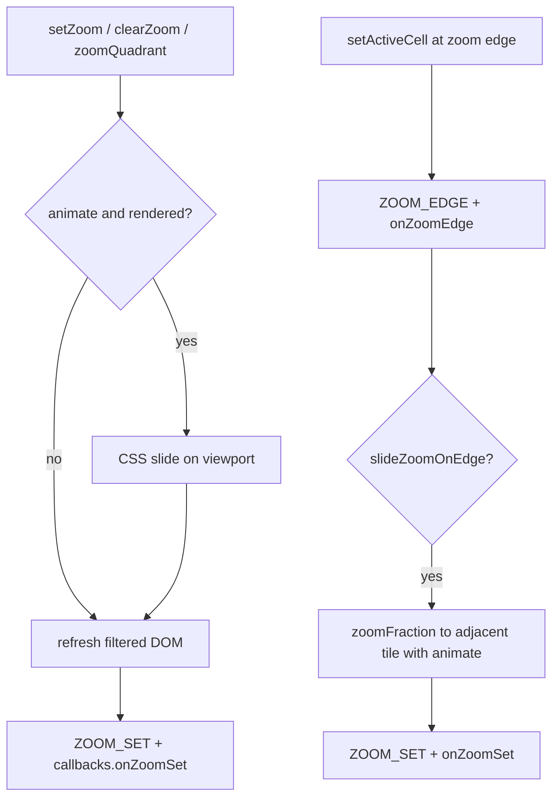

# Zoom v2: filtered render, slide animation, edge advance, demo

Builds on the shipped v1 API in [`src/index.ts`](src/index.ts), [`src/zoom.ts`](src/zoom.ts), and [`src/__tests__/zoom.test.ts`](src/__tests__/zoom.test.ts). v1 movement/events stay; this work makes zoom **visible** and **automatable**. Extension points remain **callbacks + events only** — no separate hooks API.

## Architecture



## 1. Filtered `renderGrid` / `refresh`

**When `state.zoom` is set**, only mount rows/cols inside bounds; when `null`, keep today's full-grid behavior.

Changes in [`src/index.ts`](src/index.ts):

- Wrap rendered rows in a new **`.gamegrid__viewport`** element (class added to [`classesEnum`](src/enums.ts); CSS in [`insertStyles`](src/utils.ts)).
- Initialize `refs.cells` to the **full matrix shape** first (`current: null` everywhere), then only attach DOM for cells inside zoom.
- Iterate `rI ∈ [minY, maxY]`, `cI ∈ [minX, min(maxX, row.length-1)]`.
- Cell width when filtered: `100 / (maxX - minX + 1)%` (not full row length).
- `data-gamegrid-coords` and `ICellContext.coords` remain **world** `[x, y]`.
- `setZoom` / `clearZoom`: when `rendered`, call `refresh()` after state merge (unless animation path below).
- `syncActiveDom` already tolerates `current: null` via optional chaining.

### Zoom CSS classes (toggle on DOM, not just inline styles)

Add BEM hooks to [`classesEnum`](src/enums.ts) and sync via a private **`syncZoomDom()`** (called from `setZoom`, `clearZoom`, `refresh`, and after slide ends):

| Class | Element | When |
|-------|---------|------|
| `gamegrid--zoomed` | container (`.gamegrid`) | `state.zoom !== null` |
| `gamegrid__viewport` | viewport wrapper | always (after v2 render) |
| `gamegrid--zoom-animating` | container | during CSS slide only |
| `gamegrid__cell--zoom-edge` | edge cells of zoom window | zoom active; cell on min/max X or Y of bounds |

**Data attributes** on viewport when zoomed (for styling/debug):

- `data-gamegrid-zoom="minX,minY,maxX,maxY"`
- `data-gamegrid-region="nw"` when `state.region?.quadrant` is set (optional, only if region tracking enabled)

Remove zoom classes/attributes on `clearZoom`.

**Default styles** in [`insertStyles`](src/utils.ts) (subtle, overridable by apps):

```css
.gamegrid--zoomed .gamegrid__viewport {
  outline: 2px solid currentColor;
  outline-offset: 2px;
}
.gamegrid__cell--zoom-edge {
  /* slightly stronger cell border on viewport perimeter */
  box-shadow: inset 0 0 0 1px currentColor;
}
.gamegrid--zoom-animating {
  pointer-events: none;
}
```

**Optional app classes** on [`IOptions`](src/interfaces.ts) (same pattern as `containerClasses`):

```ts
/** Appended to `.gamegrid__viewport` whenever zoom is active. */
zoomViewportClasses?: string[];
```

Tests: after `zoomQuadrant('se')`, container has `gamegrid--zoomed`, viewport has `data-gamegrid-zoom`, edge cells have `gamegrid__cell--zoom-edge`; after `clearZoom()`, zoom classes removed. Also in [`src/__tests__/rendering.test.ts`](src/__tests__/rendering.test.ts) and [`src/__tests__/zoom.test.ts`](src/__tests__/zoom.test.ts):

- 6×6 grid + `zoomQuadrant('se')` → DOM has 9 cells (3×3), not 36.
- `clearZoom()` → full 36 cells return.
- Active cell highlight still works inside filtered view.

## 2. Built-in zoom slide animation

Honor existing `animate` resolution (`IZoomOptions.animate` → `IOptions.animateZoom`).

New option on [`IOptions`](src/interfaces.ts):

```ts
/** CSS transition duration (ms) for zoom slide. Default: 300. */
zoomSlideDuration?: number;
```

Implementation in new helper [`src/zoom-render.ts`](src/zoom-render.ts):

- `computeSlideOffset(from, to, viewportEl)` — delta in pixels from bounds shift.
- `runZoomSlide(container, viewport, from, to, duration): Promise<void>`:
  1. Apply `transform: translate(dx, dy)` on viewport.
  2. `refresh()` with new zoom (content swapped under transform).
  3. `requestAnimationFrame` → transition to `transform: none`.
  4. Resolve on `transitionend` (timeout fallback for jsdom).

CSS in [`src/utils.ts`](src/utils.ts) (extends zoom class defaults in §1):

```css
.gamegrid { overflow: hidden; }
.gamegrid__viewport { transition: transform var(--gamegrid-zoom-duration, 300ms) ease-out; }
```

(`gamegrid--zoom-animating` pointer-events rule lives with other zoom class defaults in §1.)

`setZoom` / `clearZoom` when `animate && rendered`:

- Capture `fromZoom` before state patch.
- Merge state, then `runZoomSlide(...)`.
- Emit `ZOOM_SET` / `ZOOM_CLEARED` and fire **`onZoomSet` / `onZoomCleared`** after slide completes.

## 3. Auto-advance on zoom edge (`slideZoomOnEdge`)

New option:

```ts
/** When true with regionDivisions set, ZOOM_EDGE auto-zooms to the adjacent region tile. Default: false. */
slideZoomOnEdge?: boolean;
```

Pure helper in [`src/zoom.ts`](src/zoom.ts):

```ts
getAdjacentRegion(tile: IRegionTile, direction: string): IRegionTile | null
```

Wire in `setActiveCell` after `ZOOM_EDGE` + `onZoomEdge` (when `slideZoomOnEdge`, `regionDivisions`, and adjacent tile exists):

- Call `zoomFraction(divisions, next.tileX, next.tileY, { animate: true })`.
- Existing `onZoomSet` fires from that `setZoom` path.

Does **not** fire a second `ZOOM_EDGE` (advance goes through `setZoom`, not another move attempt).

Apps that want custom edge behavior can set `slideZoomOnEdge: false` and use `onZoomEdge` + `zoomQuadrant(..., { animate: true })` instead.

## 4. Demo UI

New demo pane following existing patterns ([`demo/src/partials/bigmaze.hbs`](demo/src/partials/bigmaze.hbs), [`demo/src/js/maze.ts`](demo/src/js/maze.ts)):

| File | Purpose |
|------|---------|
| [`demo/src/partials/zoommaze.hbs`](demo/src/partials/zoommaze.hbs) | 50×50 grid wrap, quadrant badge, NW/NE/SW/SE jump buttons, d-pad |
| [`demo/src/js/zoom-maze.ts`](demo/src/js/zoom-maze.ts) | `setupZoomMaze()` — `regionDivisions: 2`, `slideZoomOnEdge: true`, `animateZoom: true`, start in `se` |
| [`demo/src/partials/offcanvas-demolist.hbs`](demo/src/partials/offcanvas-demolist.hbs) | Nav button |
| [`demo/src/index.html`](demo/src/index.html) | Include partial |
| [`demo/src/js/main.ts`](demo/src/js/main.ts) | Wire setup + d-pad |
| [`demo/src/styles/styles.scss`](demo/src/styles/styles.scss) | Optional pane styling |

Demo listens to `REGION_CHANGE` / `ZOOM_SET` to update a “Current region: SE” badge. Jump buttons call `zoomQuadrant(..., { animate: true })`.

## 5. Docs

Update [`README.md`](README.md) Zoom section:

- Filtered render when zoom is active.
- `zoomSlideDuration`, `slideZoomOnEdge`.
- Zoom CSS classes (`gamegrid--zoomed`, `gamegrid__viewport`, `gamegrid__cell--zoom-edge`, `zoomViewportClasses`).
- Slide uses CSS transform on `.gamegrid__viewport`.
- Edge auto-slide vs manual `onZoomEdge` pattern.

## Implementation order

1. Viewport wrapper + filtered `renderGrid` + `refresh` on zoom change.
2. `runZoomSlide` + `zoomSlideDuration`.
3. `getAdjacentRegion` + `slideZoomOnEdge`.
4. Demo + docs + tests.

## Out of scope

- Separate **hooks** abstraction (use existing callbacks + events).
- Async/Promise callbacks.
- Pinch-to-zoom or scale-based zoom (cell-window only).
