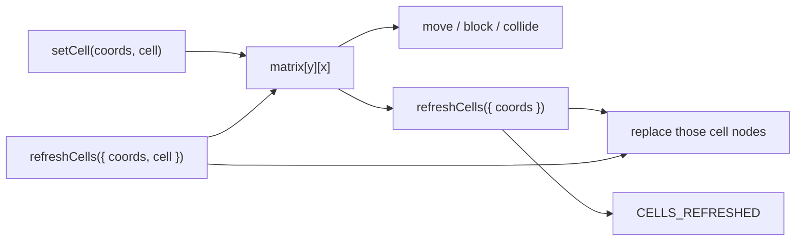

# GameGrid

**A 2D HTML Grid for Creating Web Games**

<small>or other things that could use a 2D matrix</small>

**Docs & demo (GitHub Pages):** [site home](https://tamb.github.io/game-grid/) · [API reference](https://tamb.github.io/game-grid/docs/) · [interactive demo](https://tamb.github.io/game-grid/demo/output.html)

**v1 follow-ups:** [ROADMAP.md](ROADMAP.md)

## Goals

- 2D grid in memory with coordinates and movement rules
- Hooks: callbacks, middleware, and DOM-optional rendering
- TypeScript types included
- Have fun with it

## Demo (Parcel app)

Try the [published demo](https://tamb.github.io/game-grid/demo/output.html) on GitHub Pages, or run it locally (below).

The **`demo/`** package depends on this library via **`"@tamb/gamegrid": "file:.."`** so `npm install` inside **`demo/`** always picks up the built **`dist/`** next to it (no **`npm pack`** tarball).

### Demo scripts (run from repo root)

| Script | Purpose |
|--------|---------|
| **`npm run demo`** | Clean lib + demo artefacts, build library, install demo deps, compile Handlebars, start Parcel |
| **`npm run demo:safe`** | Same as **`demo`**, but runs tests before building |
| **`npm run demo:dev`** | Start Parcel only (after **`demo:prepare`** or a prior **`demo`** run) |
| **`npm run demo:test`** | Run library Vitest suite |
| **`npm run demo:prepare`** | **`npm run build`** + **`npm install`** in **`demo/`** |
| **`npm run demo:build`** | Production Parcel build in **`demo/dist`** |
| **`npm run demo:link`** | Build, **`npm link`** the library, install demo deps, link **`@tamb/gamegrid`** in the demo |
| **`npm run demo:link:lib`** | Build + **`npm link`** only (registers **`@tamb/gamegrid`** globally) |

Fresh start:

```bash
npm run demo
```

Fast iteration after library changes (rebuild **`dist/`**, then reload Parcel):

```bash
npm run build && npm run demo:dev
```

**`npm link` workflow** (optional):

```bash
npm run demo:link
npm run demo:dev
```

After a change to the library, run **`npm run build`** again so **`dist/`** updates; Parcel will pick it up on reload when using **`file:..`** or a **`npm link`** symlink.

## API documentation (TypeDoc)

Browse the [published API reference](https://tamb.github.io/game-grid/docs/) on GitHub Pages, or generate HTML locally:

```bash
npm run docs
```

HTML lands in **`gh-pages/docs/`** (open **`gh-pages/docs/index.html`** locally). The TypeDoc landing page uses **`docs/API.md`** (overview + table of contents); the full README stays on GitHub.

Combined **demo + docs** bundle for GitHub Pages:

```bash
npm run gh-pages
```

That clears **`gh-pages/docs`** and **`gh-pages/demo`**, **`npm run build`**, reinstalls **`demo/`** deps, runs TypeDoc to **`gh-pages/docs`**, and **`parcel build`** to **`gh-pages/demo/`**. The checked-in **`gh-pages/index.html`** links to **`demo/output.html`** and **`docs/`**.

## GitHub Pages

Live site: **https://tamb.github.io/game-grid/** (API docs at **`/docs/`**, demo at **`/demo/output.html`**).

Use **`gh-pages/`** as the site root **`/`**: keep **`index.html`** and **`.nojekyll`** tracked. Generated **`gh-pages/docs/`** and **`gh-pages/demo/`** are **gitignored** (so they won't show up in `git status`) — editors may hide gitignored folders; this repo sets **`explorer.excludeGitIgnore`** to **`false`** in **`.vscode/settings.json`** so `gh-pages/demo` stays visible locally. Confirm with **`ls gh-pages/demo`** after **`npm run gh-pages`**.

**TSDoc tip:** `{@link …}` tags must appear in normal comment text. Wrapping the whole `{@link …}` in inline code (Markdown backticks) stops TypeDoc from resolving links in the generated HTML.

## Coordinates

Movement and state use **`[x, y]`**: **column (x), then row (y)**. The backing matrix is a normal 2D array: **`matrix[row][col]`** i.e. **`matrix[y][x]`**. Methods like **`getCell([x, y])`**, **`setCell([x, y], cell)`**, **`refreshCells({ coords, cell })`**, **`setActiveCell(x, y, …)`**, and **`getState().activeCoords`** all follow that convention.

## The class

Install **`@tamb/gamegrid`**. The **default export** is **`GameGrid`**. Many constants and types are **named exports** (see [Public exports](#public-exports)).

```ts
import type { IGameGrid } from "@tamb/gamegrid";
import GameGrid from "@tamb/gamegrid";

// Optional second argument: container to render into immediately.
const grid: IGameGrid = new GameGrid(config, rootElement);

// Headless (no DOM): omit the container.
const memory: IGameGrid = new GameGrid(config);
```

When you pass a **`container`** in the constructor, **`render(container)`** runs immediately. Otherwise call **`render(element)`** later. Headless mode sets **`refs.cells`** to your matrix reference and **`state.rendered`** to **`false`**.

**`render`** paints the current active cell and emits **`RENDERED`**. It does **not** call **`setActiveCell`**, so construction / remount will not fire land, collide, dettach, or **`ICell.eventTypes`**.

Per-cell **`eventTypes.onEnter` / `onExit`** are custom event name strings. When the active cell changes, the grid dispatches **`onExit`** for the previous cell, then **`onEnter`** for the landed cell, on **`options.eventTarget`** (same bus as built-in events). Extra **`detail`**: **`coords`**, **`cell`**.

### `config: IConfig`

```ts
export interface IConfig {
  options?: IOptions;
  matrix: ICell[][];
  state?: IDefaultState | IState;
}
```

### `options: IOptions`

```ts
export type MiddlewareFn = (
  gamegridInstance: IGameGrid,
  patch: StatePatch,
) => void;

export interface IOptions {
  id?: string;
  /** Dispatches custom events here; defaults to `window`. */
  eventTarget?: EventTarget;
  arrowControls?: boolean;
  wasdControls?: boolean;
  /**
   * Milliseconds to wait before accepting another directional move.
   * - `number`: shared cooldown for any direction
   * - `[Top, Right, Down, Left]`: per-direction cooldowns (UP, RIGHT, DOWN, LEFT)
   *
   * Change at runtime with `setOptions({ moveDebounce: … })` — no re-render needed (e.g. speed power-ups).
   */
  moveDebounce?: number | [number, number, number, number];
  infiniteX?: boolean;
  infiniteY?: boolean;
  clickable?: boolean;
  /**
   * Max length of `state.moves`. Oldest entries drop first.
   * Values below `1` are treated as `1` (always keep the current cell). Default: `20`.
   */
  rewindLimit?: number;
  middlewares?: {
    pre?: MiddlewareFn[];
    post?: MiddlewareFn[];
  };
  callbacks?: {
    onMove?: (gamegridInstance: IGameGrid, newState: IState) => void;
    onLand?: (gamegridInstance: IGameGrid, newState: IState) => void;
    onBlock?: (gamegridInstance: IGameGrid, newState: IState) => void;
    onCollide?: (gamegridInstance: IGameGrid, newState: IState) => void;
    onDettach?: (gamegridInstance: IGameGrid, newState: IState) => void;
    onBoundary?: (gamegridInstance: IGameGrid, newState: IState) => void;
    onBoundaryX?: (gamegridInstance: IGameGrid, newState: IState) => void;
    onBoundaryY?: (gamegridInstance: IGameGrid, newState: IState) => void;
    onWrap?: (gamegridInstance: IGameGrid, newState: IState) => void;
    onWrapX?: (gamegridInstance: IGameGrid, newState: IState) => void;
    onWrapY?: (gamegridInstance: IGameGrid, newState: IState) => void;
    onZoomSet?: (gamegridInstance: IGameGrid, newState: IState) => void;
    onZoomCleared?: (gamegridInstance: IGameGrid, newState: IState) => void;
    onZoomEdge?: (gamegridInstance: IGameGrid, newState: IState) => void;
    onZoomExit?: (gamegridInstance: IGameGrid, newState: IState) => void;
    onRegionChange?: (gamegridInstance: IGameGrid, newState: IState) => void;
    onRewind?: (gamegridInstance: IGameGrid, newState: IState) => void;
    onUnrewind?: (gamegridInstance: IGameGrid, newState: IState) => void;
  };

  /** Cell `type` values you cannot step onto; you stay on the previous cell. */
  blockOnType?: string[];
  /** Cell `type` values that trigger collision when entered (you still move unless also blocked). */
  collideOnType?: string[];
  /**
   * If non-empty, only these `type` values are enterable (in addition to `blockOnType`).
   * If omitted or empty, any non-blocked cell is enterable.
   */
  moveOnType?: string[];

  /** Default whether zoom transitions animate. Overridden by per-call `IZoomOptions.animate`. */
  animateZoom?: boolean;
  /** When zoom is set, keep movement inside the zoom window (default `true`). */
  constrainToZoom?: boolean;
  /** Opt-in region tracking (`2` = quadrants, `3` = ninths). */
  regionDivisions?: number;

  /** CSS transition duration (ms) for zoom slide. Default: `300`. */
  zoomSlideDuration?: number;
  /** When `true` with `regionDivisions`, `ZOOM_EDGE` auto-zooms to the adjacent region. Default: `false`. */
  slideZoomOnEdge?: boolean;
  /** Appended to `.gamegrid__viewport` when zoom is active. */
  zoomViewportClasses?: string[];

  /**
   * Inject bundled layout CSS on render (default `true`).
   * Set `false` to skip injection and style `.gamegrid` yourself.
   */
  injectStyles?: boolean;

  activeClasses?: string[];
  cellClasses?: string[];
  containerClasses?: string[];
  rowClasses?: string[];
}
```

Default options (before your `config.options` spread):

```ts
{
  arrowControls: true,
  wasdControls: false,
  infiniteX: false,
  infiniteY: false,
  clickable: true,
  rewindLimit: 20,
  blockOnType: [cellTypeEnum.BARRIER],
  collideOnType: [cellTypeEnum.INTERACTIVE],
  moveOnType: [],
  animateZoom: false,
  constrainToZoom: true,
  zoomSlideDuration: 300,
  slideZoomOnEdge: false,
  injectStyles: true,
}
```

Use **`cellAttributes`** on **`ICell`** for per-cell attributes; **`activeClasses`** / **`cellClasses`** / **`containerClasses`** / **`rowClasses`** append classes on render. Set **`injectStyles: false`** to skip the bundled stylesheet (layout, zoom viewport, and a 2px `currentColor` active ring) and supply your own CSS.

### `matrix: ICell[][]`

Rows of cells. Each **`ICell`** must include **`type`** (see **`cellTypeEnum`**). Optional **`render`**, **`cellAttributes`**, etc.

```ts
export interface ICell extends IRef {
  type: string;
  render?: (context: ICellContext) => HTMLElement;
  cellAttributes?: string[][];
  /**
   * Custom event names on the grid `eventTarget` when the active cell changes.
   * `onExit` of the previous cell, then `onEnter` of the landed cell.
   * Extra `detail`: `coords`, `cell`. Not fired on blocked stays or `render()`.
   */
  eventTypes?: { onEnter: string; onExit: string };
  coords?: number[];
  [key: string]: unknown;
}

interface ICellContext {
  coords: number[];
  cell: ICell;
  gamegrid: IGameGrid;
}

export interface ICellRefresh {
  coords: readonly [number, number] | number[];
  cell?: ICell;
}
```

### Updating cells

`setCell` and `refreshCells` split **data** from **view**. Movement, collision, and `getCell` always read the matrix. The mounted markup changes only when you refresh.



**`setCell([x, y], cell)`** is data-only. It replaces `matrix[y][x]` by reference. It does not patch DOM, `refs.cells`, or emit events. After the write, `getCell` / `getActiveCell` / `getPreviousCell` / `getAllCellsByType` / `blockOnType` see the new cell data immediately; the painted tile (`current`) can still show the old `type` until **`refreshCells`**.

**`refreshCells({ coords, cell? } | array)`** is the view (plus an optional write). For each item it:

1. Calls `setCell` when `cell` is provided
2. Replaces that one mounted node from the current matrix entry (`type`, `cellAttributes`, `render`, zoom-edge class) when the tile is on-screen
3. Restores active-cell classes if the focused tile was rebuilt
4. Dispatches **`gridEventsEnum.CELLS_REFRESHED`** once, with `detail.cells`

Omit `cell` when you already called `setCell` or mutated the matrix object in place. Headless grids update data only. Off-screen tiles under zoom stay `current: null`.

```ts
// Two steps: data first, then paint
grid.setCell([2, 0], { type: cellTypeEnum.OPEN });
grid.refreshCells({ coords: [2, 0] });

// One step: write + paint
grid.refreshCells({ coords: [2, 0], cell: { type: cellTypeEnum.OPEN } });

// Several tiles
grid.refreshCells([
  { coords: [1, 1], cell: { type: cellTypeEnum.BARRIER } },
  { coords: [0, 2] },
]);
```

Use **`refresh()`** when the grid **shape** changes (`setMatrix` with new dimensions, or a new zoom window). Use **`refreshCells`** when a few tiles change in place.

| | `setCell` | `refreshCells` | `refresh` |
| --- | --- | --- | --- |
| Writes matrix | yes | if `cell` is given | no |
| Patches DOM | no | those tiles only | whole grid |
| Updates `refs.cells` | no | those tiles | whole grid |
| Emits | — | `CELLS_REFRESHED` | — |

### `state: IState`

```ts
export interface IState {
  activeCoords: number[];
  prevCoords: number[];
  /** Oldest-first landed `[x, y]` trail, including the current cell. Capped by `rewindLimit`. */
  moves: number[][];
  /** Oldest-first coords undone by `rewind` / `rewindTo`. Replayed by `unrewind` / `unrewindTo`. */
  future: number[][];
  rendered?: boolean;
  currentDirection?: string;
  zoom: IZoomBounds | null;
  region: IRegionTile | null;
}

export type StatePatch = Partial<IState> & Record<string, unknown>;
```

**`setStateSync(patch)`** shallow-merges a **`StatePatch`** into state. **`StatePatch`** still allows arbitrary extra keys for your own bookkeeping.

Initial merge uses **`INITIAL_STATE`** from the package (actual export lives in **`src/enums.ts`**):

```ts
export const INITIAL_STATE: IState = {
  activeCoords: [0, 0],
  prevCoords: [0, 0],
  rendered: false,
  moves: [],
  future: [],
  currentDirection: directionEnum.DOWN,
  zoom: null,
  region: null,
};
```

### Middleware

**`pre`** runs before the merge; you can mutate the **`patch`** object in place before it is merged.

**`post`** runs after the merge; use **`gamegridInstance.getState()`** for the full merged **`IState`**. The second argument remains the **`patch`** passed to **`setStateSync`**.

## Refs

```ts
export interface IRefsObject {
  container: HTMLElement | null;
  rows: IRow[];
  cells: ICell[][];
}

export interface IRow extends IRef {
  index: number;
  cells: ICell[];
}
```

**`IRow`** can carry a **`current`** **`HTMLDivElement`** for the row when rendered. **`IRefs`** is a deprecated alias for **`IRefsObject`**.

## `IGameGrid` (instance API)

```ts
export interface IGameGrid {
  refs: IRefsObject;
  options: IOptions;

  render(container: HTMLElement): void;
  /** Rebuild DOM from current `matrix` and re-apply active cell UI. Requires a prior render. */
  refresh(): void;
  /** Write optional cell data and rebuild one or more cell nodes. Emits CELLS_REFRESHED. */
  refreshCells(cells: ICellRefresh | ICellRefresh[]): void;
  /** Tear down listeners and DOM when rendered; always emits DESTROYED. */
  destroy(): void;
  getOptions(): IOptions;
  setOptions(newOptions: IOptions): void;

  getState(): IState;
  setStateSync(obj: StatePatch): void;

  /** Matrix cell at `activeCoords`, plus mounted `current` / `coords` when rendered. */
  getActiveCell(): ICell;
  getPreviousCell(): ICell;
  getCell(coords: readonly [number, number] | number[]): ICell;
  /** Replace one logical cell. Does not render; call `refreshCells()` or `refresh()` when mounted if the DOM should catch up. */
  setCell(coords: readonly [number, number] | number[], cell: ICell): void;
  getAllCellsByType(type: string): ICell[];
  setActiveCell(x: number, y: number, direction?: string): void;

  getMatrix(): ICell[][];
  setMatrix(matrix: ICell[][]): void;

  moveUp(): void;
  moveRight(): void;
  moveDown(): void;
  moveLeft(): void;
  /** Walk to one `[x, y]` or along an explicit path through setActiveCell. Stops on a blocked / missed step. */
  moveTo(coordsOrPath: readonly [number, number] | number[] | Array<readonly [number, number] | number[]>): void;
  /** Step back `steps` entries in `state.moves` (default 1). Extra steps clamp to the oldest. Dropped coords go to `state.future`. */
  rewind(steps?: number): void;
  /** Jump to `index` in `state.moves` (`0` = oldest). Later entries move to `state.future`. */
  rewindTo(index: number): void;
  /** Replay `steps` entries from `state.future` (default 1). Redo after rewind. */
  unrewind(steps?: number): void;
  /** Jump forward to `index` in the combined trail (`moves` then `future`). */
  unrewindTo(index: number): void;

  getZoom(): IZoomBounds | null;
  setZoom(bounds: IZoomBounds, options?: IZoomOptions): void;
  clearZoom(options?: IZoomOptions): void;
  getZoomAround(center: readonly [number, number] | number[], radiusX: number, radiusY?: number): IZoomBounds;
  getQuadrantZoom(quadrant: ZoomQuadrant): IZoomBounds;
  getFractionZoom(divisions: number, tileX: number, tileY: number): IZoomBounds;
  zoomAround(center: readonly [number, number] | number[], radiusX: number, radiusY?: number, options?: IZoomOptions): void;
  zoomQuadrant(quadrant: ZoomQuadrant, options?: IZoomOptions): void;
  zoomFraction(divisions: number, tileX: number, tileY: number, options?: IZoomOptions): void;
  getRegionAt(coords: readonly [number, number] | number[], divisions?: number): IRegionTile;
  getActiveRegion(): IRegionTile | null;
}
```

The **`GameGrid`** class implements **`IGameGrid`**. The mounted root element is **`refs.container`** after **`render`**; it stays **`null`** on headless constructions until **`render`** runs.

**`rewind(steps?)`** and **`rewindTo(index)`** walk **`state.moves`**, an oldest-first trail of landed cells (including the current one) capped by **`rewindLimit`**. Blocked attempts are not recorded. Extra `rewind` steps clamp to the oldest remaining entry. Dropped coords go onto **`state.future`**. These calls emit **`gamegrid:move:rewind`** then **`MOVE_LAND`**, and they ignore **`moveDebounce`**.

**`unrewind(steps?)`** and **`unrewindTo(index)`** replay **`state.future`**. A new landed cell (move, click, or **`moveTo`**) clears the forward stack; a blocked stay does not. Same debounce exception. Emits **`gamegrid:move:unrewind`** then **`MOVE_LAND`**.

**`moveTo(coords)`** walks one cell or an explicit list of **`[x, y]`** steps through **`setActiveCell`** (block / collide / wrap / zoom-edge). It does not pathfind. The walk stops when a step does not land on the requested cell.

```ts
grid.moveTo([2, 1]);
grid.moveTo([
  [0, 1],
  [0, 2],
  [1, 2],
]);
grid.rewind();
grid.unrewind();
```

## Events

Events are bubbling **`CustomEvent`s**. Their **`detail`** objects implement **`IGameGridEventDetail`**: at minimum `{ gameGridInstance: IGameGrid }` (plus any extra keys you pass if you call **`fireGameGridEvent`** yourself). **`MOVE_*`**, wrap, and boundary events also include **`IMoveEventDetail`**: **`from`**, **`to`** (candidate cell after wrap/clamp), **`direction`**, and **`blocked`**. For typing listeners, use **`GameGridDOMEvent`** (`CustomEvent<IGameGridEventDetail>`).

By default the grid dispatches on **`window`**. Set **`options.eventTarget`** (for example a dedicated **`EventTarget`**) so multiple grids do not all share the global bus.

**`gameGridEventsEnum`** is an identical compatibility alias — use either name.

```ts
export const gridEventsEnum = {
  // Dispatched after GameGrid.render wires the container (`detail` follows IGameGridEventDetail).
  RENDERED: "gamegrid:grid:rendered",
  // Dispatched at the end of construction (after optional initial render).
  CREATED: "gamegrid:grid:created",
  // Dispatched from GameGrid.destroy; fires even if the grid stayed headless / unmounted.
  DESTROYED: "gamegrid:grid:destroyed",
  // After refreshCells writes optional data and patches those nodes (`detail.cells`).
  CELLS_REFRESHED: "gamegrid:cells:refreshed",

  // Keyboard / pointer path: onMove already ran; these fire before setActiveCell.
  // Extra detail: from, to, direction, blocked (IMoveEventDetail).
  MOVE_LEFT: "gamegrid:move:left",
  MOVE_RIGHT: "gamegrid:move:right",
  MOVE_UP: "gamegrid:move:up",
  MOVE_DOWN: "gamegrid:move:down",

  // Target rejected by blockOnType or moveOnType allow-list; coords roll back.
  // blocked: true; to is the rejected cell.
  MOVE_BLOCKED: "gamegrid:move:blocked",
  // Entered a collideOnType cell. Only when the active cell actually changes.
  MOVE_COLLISION: "gamegrid:move:collide",
  // Left a collide-type cell for a non-collide cell. Not on blocked stays or collide → collide.
  MOVE_DETTACH: "gamegrid:move:dettach",
  // Finished block/collide/boundary/wrap resolution; mirrors callbacks.onLand.
  // Only when the active cell actually changes — not on blocked stays, edge bumps, or render().
  MOVE_LAND: "gamegrid:move:land",
  // After rewind() / rewindTo(); detail.steps + detail.index + move detail; then MOVE_LAND.
  REWIND: "gamegrid:move:rewind",
  // After unrewind() / unrewindTo(); detail.steps + detail.index + move detail; then MOVE_LAND.
  UNREWIND: "gamegrid:move:unrewind",

  // Aggregate finite-edge clamp — axis BOUNDARY_X / BOUNDARY_Y first when relevant.
  BOUNDARY: "gamegrid:move:boundary",
  // X-axis requested outside row span when infiniteX is off — coordinate clamped.
  BOUNDARY_X: "gamegrid:move:boundary:x",
  // Y-axis requested outside matrix height when infiniteY is off — coordinate clamped.
  BOUNDARY_Y: "gamegrid:move:boundary:y",

  // Aggregate infinite wrap — WRAP_X / WRAP_Y first when relevant.
  WRAP: "gamegrid:move:wrap",
  // Horizontal infinite teleport; runs alongside callbacks.onWrapX.
  WRAP_X: "gamegrid:move:wrap:x",
  // Vertical infinite teleport; runs alongside callbacks.onWrapY.
  WRAP_Y: "gamegrid:move:wrap:y",

  // Zoom viewport lifecycle
  ZOOM_SET: "gamegrid:zoom:set",
  ZOOM_CLEARED: "gamegrid:zoom:cleared",
  ZOOM_EDGE: "gamegrid:zoom:edge",
  ZOOM_EXIT: "gamegrid:zoom:exit",
  REGION_CHANGE: "gamegrid:region:change",
};
```

This mirrors **`src/enums.ts`** (same keys and string literals). Import **`gridEventsEnum`** or **`gameGridEventsEnum`** from **`@tamb/gamegrid`** rather than duplicating. The [published TypeDoc site](https://tamb.github.io/game-grid/docs/) (or **`npm run docs`** locally) expands the same members with full cross-links.

## Instantiation quick start

```ts
import GameGrid, { gridEventsEnum, type GameGridDOMEvent } from "@tamb/gamegrid";

const gg = new GameGrid(
  {
    matrix: myMatrix,
    state: { activeCoords: [0, 0] },
    options: { wasdControls: true },
  },
  document.querySelector("#root")!,
);

gg.moveDown();
window.addEventListener(gridEventsEnum.MOVE_LAND, (e: Event) => {
  const ce = e as GameGridDOMEvent;
  console.log(ce.detail.gameGridInstance);
});
```

For a grid created without a container, call **`render(el)`** when you want DOM.

## Zoom

Zoom defines a **viewport window** over the full matrix. Coordinates stay world **`[x, y]`** — zoom does not create a submatrix or remap the origin.

| Term | Meaning |
|------|---------|
| **zoom** | Current viewport bounds (`IZoomBounds` on state) |
| **region** | A tile from partitioning the grid (`regionDivisions`; quadrants when `2`) |
| **zoom edge** | Active cell tried to move past the zoom window while `constrainToZoom` is enabled |
| **zoom exit** | Active cell left the zoom window while `constrainToZoom` is disabled |
| **region change** | Active cell moved from one region tile to another (e.g. SE → SW) |
| **zoom slide** | Moving the zoom window with `animate: true` (built-in CSS transform on `.gamegrid__viewport`) |

When zoom is active, the grid **renders only cells inside the zoom window** inside a `.gamegrid__viewport` wrapper. Useful CSS hooks:

| Class / attribute | When |
|-------------------|------|
| `gamegrid--zoomed` | Container while zoom is set |
| `gamegrid__viewport` | Viewport wrapper (always after render) |
| `gamegrid__cell--zoom-edge` | Perimeter cells of the zoom window |
| `gamegrid--zoom-animating` | During CSS slide transition |
| `data-gamegrid-zoom` | Viewport; `"minX,minY,maxX,maxY"` |
| `data-gamegrid-region` | Viewport; quadrant label when `regionDivisions: 2` |

```ts
import GameGrid, { gridEventsEnum, type ZoomQuadrant } from "@tamb/gamegrid";

const gg = new GameGrid({
  matrix: largeMap,
  options: {
    regionDivisions: 2,
    animateZoom: true,
    slideZoomOnEdge: true,
    constrainToZoom: true,
    zoomSlideDuration: 300,
  },
});

gg.zoomQuadrant("se");

// Manual edge slide (when slideZoomOnEdge is false):
target.addEventListener(gridEventsEnum.ZOOM_EDGE, (e) => {
  const { gameGridInstance } = e.detail;
  gameGridInstance.zoomQuadrant("sw", { animate: true });
});
```

With **`slideZoomOnEdge: true`**, the library auto-advances to the adjacent region on `ZOOM_EDGE` — no listener required.

## Public exports

Besides the **`default`** **`GameGrid`**, the package re-exports:

- Types: **`IConfig`**, **`IOptions`**, **`IState`**, **`IGameGrid`**, **`IGameGridEventDetail`**, **`IMoveEventDetail`**, **`GameGridDOMEvent`**, **`ICell`**, **`ICellContext`**, **`IRefsObject`**, **`IRow`**, **`IDefaultState`**, **`IZoomBounds`**, **`IZoomOptions`**, **`IRegionTile`**, **`ZoomQuadrant`**, **`MiddlewareFn`**, **`StatePatch`**, and deprecated **`IRefs`**
- Values: **`gridEventsEnum`**, **`gameGridEventsEnum`**, **`cellTypeEnum`**, **`classesEnum`**, **`directionEnum`**, **`directionClassEnum`**, **`INITIAL_STATE`**, **`keycodeEnum`**

**`cellTypeEnum`** values are constants on an object (**not** an `enum`). **`classesEnum`** and **`directionEnum`** are TypeScript enums. Example:

```ts
import GameGrid, {
  cellTypeEnum,
  classesEnum,
  directionEnum,
  gridEventsEnum,
} from "@tamb/gamegrid";

// cell — const object:
cellTypeEnum.OPEN;

// enums:
classesEnum.GRID;
directionEnum.DOWN;

// Event name strings — see [Events](#events) for the full map
gridEventsEnum.BOUNDARY === "gamegrid:move:boundary";
```
